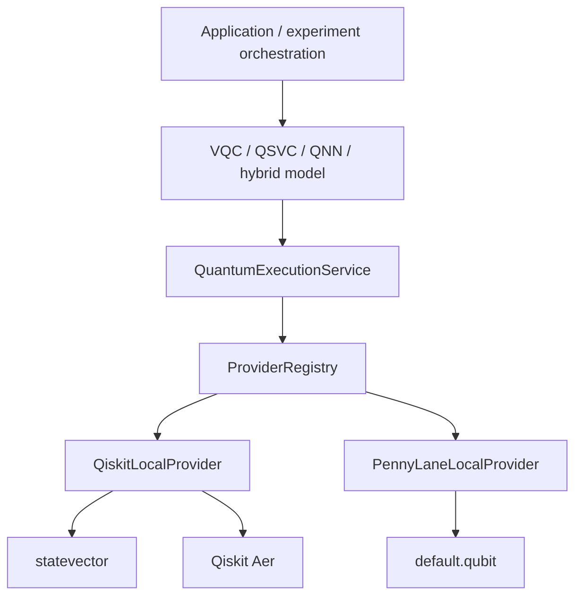

# Quantum provider architecture

## Scope

EntangleX Q-Health separates research/model behavior from quantum execution. This release adapts only the execution paths already present in the repository:

- `qiskit_local` with `statevector` and `aer` backends for VQC, QSVC, and QNN.
- `pennylane_local` with `default.qubit` for the existing PennyLane + PyTorch hybrid model.

Both are local simulators. No remote provider, cloud account, or hardware execution is implemented or implied.

## Provider and backend identity

A **provider** owns SDK-specific initialization, capability mapping, validation, health, execution, and error translation. A **backend** is one execution target exposed by that provider. They are persisted separately as `provider_id` and `backend_id`; UI labels are never used as identity.

Provider categories are `LOCAL_SIMULATOR`, `REMOTE_SIMULATOR`, `HARDWARE`, and `CUSTOM`. Only local simulators are registered. Backend descriptors report availability and only capabilities known from the adapter. Unknown facts remain `UNKNOWN` rather than being promoted to support.

## Adapter contract

`QuantumProvider` defines:

- backend discovery and lookup;
- safe configuration validation;
- model-runtime construction;
- normalized direct execution where the SDK supports it;
- resource estimates labeled `ESTIMATED`;
- health checks;
- explicit cancellation behavior.

`ProviderRegistry` rejects duplicate identities and unknown lookups. `QuantumExecutionService` is the application-facing boundary used by models and APIs. There is no implicit provider or backend fallback.

The compatibility types in `app.quantum.backends` preserve existing imports while delegating runtime creation to the service.

## Capabilities

Capabilities use `SUPPORTED`, `UNSUPPORTED`, or `UNKNOWN`. The snapshot includes sampling, statevector, estimator, shots, noise, hardware, async jobs, cancellation, batching, gradients, parameterized circuits, and known limits. A snapshot is included in fitted model metadata so later diagnostics and comparison code can consume execution-time facts without consulting current provider state.

## Requests, results, status, and errors

`ExecutionRequest` carries circuit(s), backend identity, execution mode, shots, parameters, seed, noise/transpile configuration, options, and caller metadata without coupling model code to a provider SDK.

`ExecutionResult` normalizes status, provider/backend identity, job identity, counts, probabilities, observables, shots, timing, metadata, safe errors, and an optional raw-result reference. Status values are `CREATED`, `QUEUED`, `RUNNING`, `COMPLETED`, `FAILED`, `CANCELLED`, and `UNKNOWN`.

Adapters translate SDK exceptions into stable categories: configuration, backend unavailable, invalid circuit, resource limit, authentication, provider, timeout, cancelled, unsupported, transient, and unknown. Public API errors are sanitized; raw SDK stack traces and exception text are not exposed.

## Configuration and credential safety

Model configuration remains distinct from provider configuration. The current schemas add explicit `provider_id` and `execution_mode` while retaining the historical `backend`, `shots`, and noise fields for compatibility.

Provider configuration fingerprints are SHA-256 hashes of canonical JSON. Secret-like keys—including tokens, passwords, credentials, API keys, private keys, and connection URLs—are recursively excluded before persistence or hashing. Credentials must come from the repository's environment/secret mechanisms; they must never enter experiment configuration, artifacts, frontend payloads, or logs.

## Execution behavior

- Statevector remains exact local simulation with no configured shots.
- Aer remains finite-shot local simulation and retains the existing optional illustrative depolarizing-noise path.
- Seeds are applied to the current local runtimes and recorded as `APPLIED`.
- PennyLane retains deterministic CPU `default.qubit` execution through a provider-created device.
- Direct cancellation and remote async job polling are explicitly unsupported by these local adapters. Existing application jobs remain the sole scheduling/resumability system.

## Provenance and observability

Fitted quantum metadata includes provider and backend identities, execution mode/kind, safe provider configuration, deterministic fingerprint, capability snapshot, shots/noise, seed status, and the explicit no-hardware flag. Run creation records a safe preflight snapshot for each selected quantum family in existing `execution_metadata`; no new persistence table or migration is required.

Operational logs may include provider, backend, execution/job IDs, status transitions, and normalized error category. They must not include provider configuration values that could contain secrets.

## API and preflight

The authenticated API exposes:

- `GET /api/quantum/providers`
- `GET /api/quantum/providers/{provider_id}`
- `GET /api/quantum/providers/{provider_id}/backends`
- `GET /api/quantum/providers/{provider_id}/capabilities`
- `POST /api/quantum/providers/preflight`
- `GET /api/quantum/providers/health`

Preflight returns `READY` or `BLOCKED`, blockers, warnings, capability snapshot, provider/backend identity, execution mode, and a safe configuration fingerprint. Unsupported requested capabilities block execution; unknown capabilities produce warnings.

## Adding a future provider

A future integration must add one adapter, registration, capability mapping, safe configuration validation, normalized error translation, and tests. Research models and orchestration must not be rewritten. Remote credentials must use the existing environment/secret mechanism. Provider-specific options must stay within the adapter boundary.

Do not advertise a provider as hardware-capable merely because the interface can represent hardware. Hardware support exists only when a connected adapter reports an actual backend as available and preflight succeeds.

## Limitations

- No cloud or hardware provider is implemented.
- Local SDK objects remain the native circuit representation inside the adapter boundary; no replacement circuit framework was introduced.
- Qiskit circuit construction remains in the existing circuit module to avoid a risky scientific refactor; execution primitives and backend initialization are isolated.
- Local providers do not support cancellation or resumable remote jobs.
- Max qubit limits are unknown unless the provider reports them; schema research bounds remain separate application validation.
